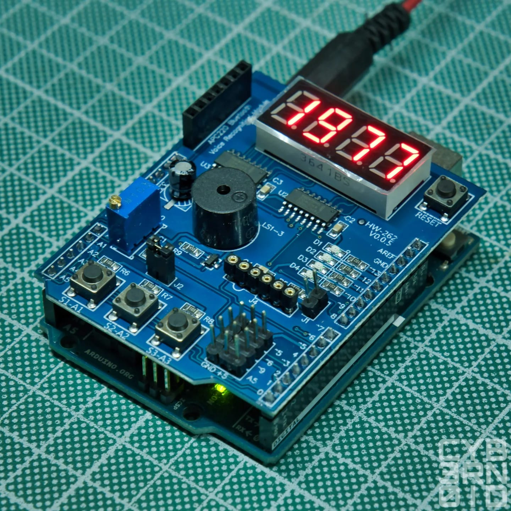

# Improved Multi-Function Shield Library

This is an improved library I've written for the classical Arduino Multifunction Shield.



You can buy that shield from here: [Sponsored Link](https://amzn.to/3ZdX9ra)

Following are the connections used by the shield:

```cpp
// leds
#define LED1 13
#define LED2 12
#define LED3 11
#define LED4 10
// multi-turn trimmer
#define POT A0
// buzzer
#define BUZZER 3
// buttons
#define BUTTON1 A1
#define BUTTON2 A2 
#define BUTTON3 A3
// shift register
#define SR_LATCH 4
#define SR_CLOCK 7
#define SR_DATA 8
// other pins
#define SENSOR_PIN A4
#define U5_PIN A4
#define U4_PIN 2
```

The *Sensor pin* (alias: *U5_PIN*) is located on the J4 header: as you can see, the J4 header has 6 pins in 2 groups of 3: the first group was intended for connecting an IR receiver (those 3 pins are also marked as `U4` on some shield variants) and the second group (`U5` on some shield variants) was intended for a temperature sensor like the LM35 (analog), or the DS18x20 (digital).

> Both the LM35 and DB18x20 in TO-92 package has the same pinout (having the flat side in front of you): left leg is GND, central leg is the signal output (`Vout` for the LM35 or `DQ` for the DS18x20), right leg is the VDD

Following is the pinout of the J4 connector (or U5 and U4) having the pin 1 on the most-left side having the 7-segments display on top:

1. Arduino Digital Pin 2 (*U4_PIN*)
2. GND
3. +5V
4. GND
5. Arduino Analog Pin A4 (*SENSOR_PIN* or *U5_PIN*)
6. +5V

> Please check the pinout with a multimeter first than connect something on it since there are lot of variants of this shield.
